<h1>MS Code - Projeto de Estoque 2024</h1>

<h2>Prints:</h2>

  <h3>Login</h3>
  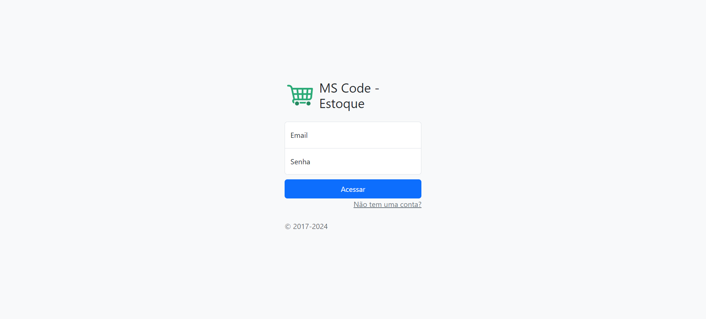
  
  <h3>Cadastrar Usuario</h3>
  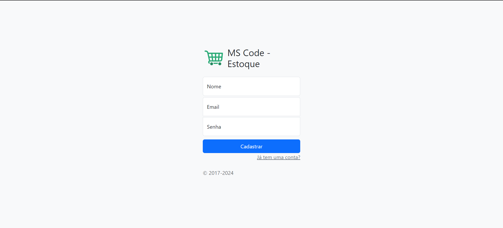

  <h3>Página Principal</h3>
  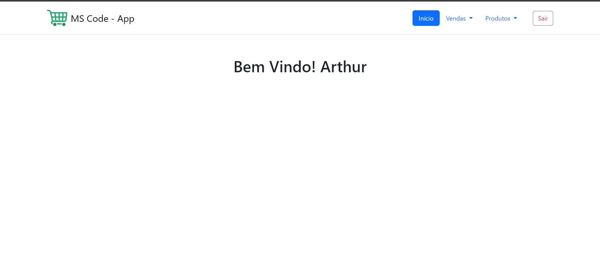

  <h3>Listar Produtos</h3>
  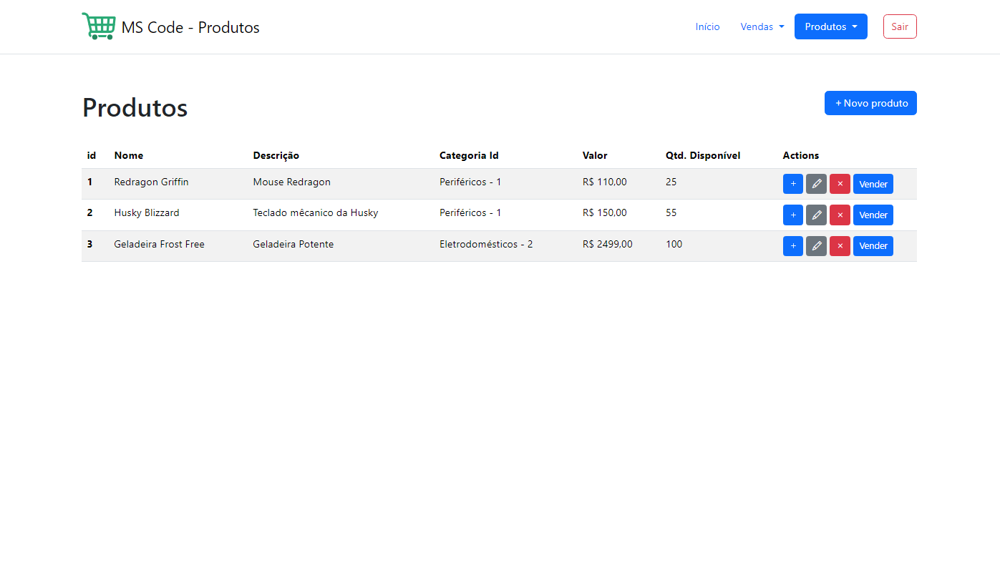

  <h3>Cadastrar Produto</h3>
  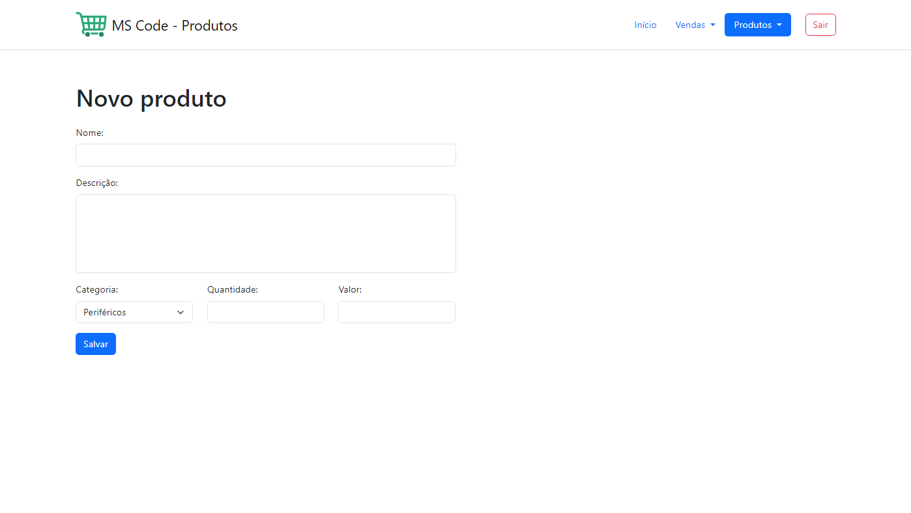

  <h3>Editar Produto</h3>
  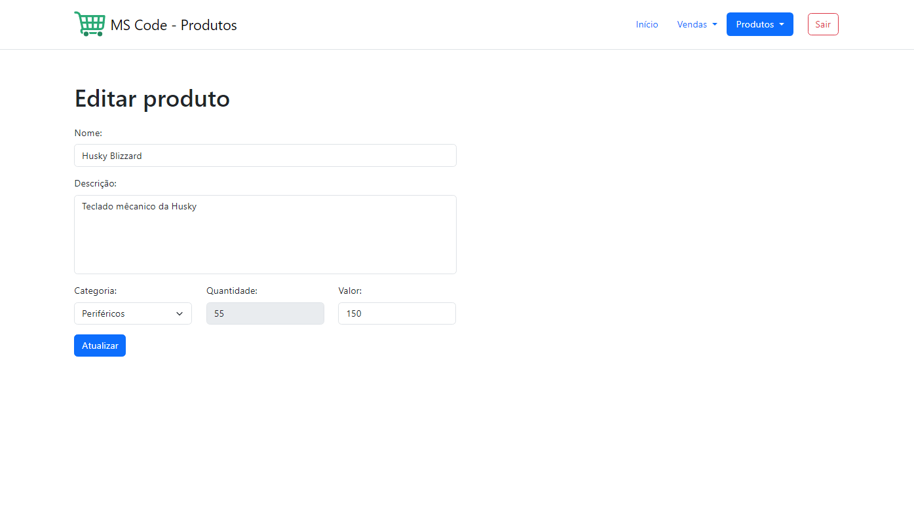

  <h3>Listar Categorias</h3>
  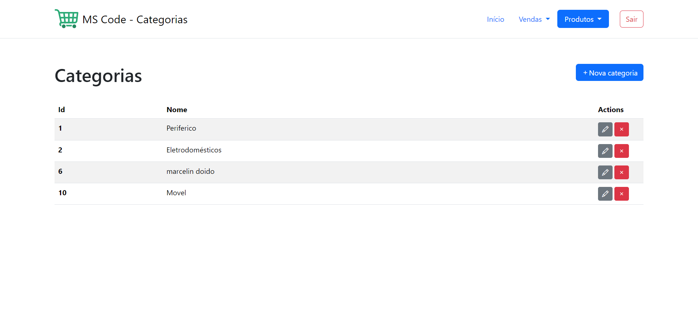

  <h3>Cadastrar Categoria</h3>
  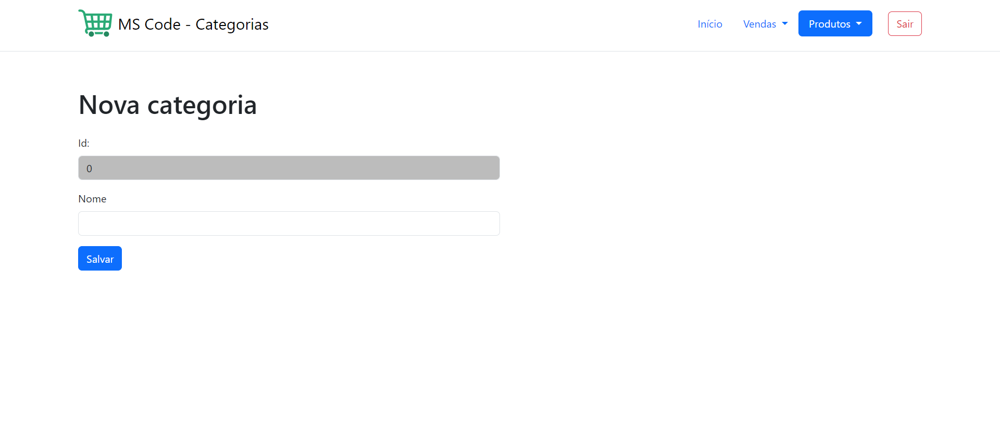

  <h3>Editar Categoria</h3>
  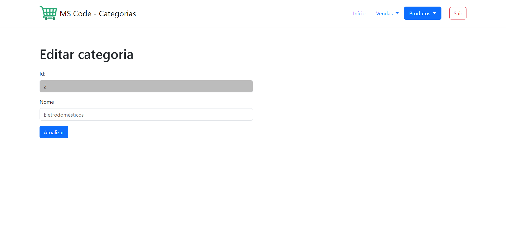

  <h3>Vendas Realizadas</h3>
  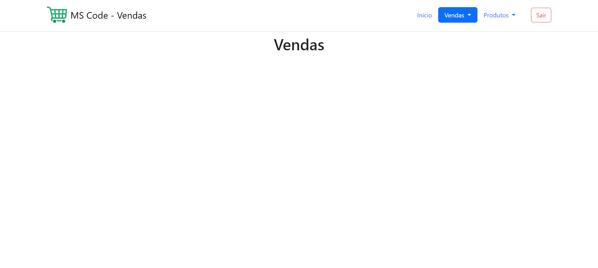

  <h3>Nova Venda</h3>
  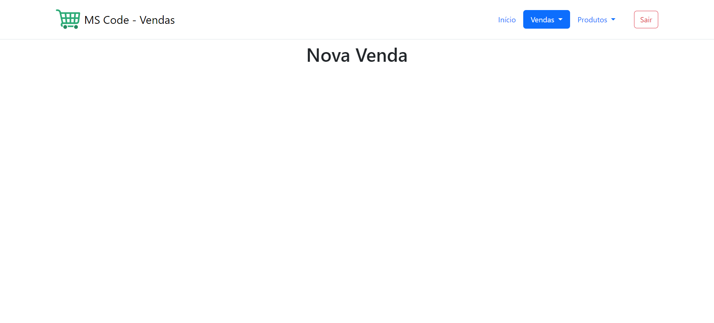

